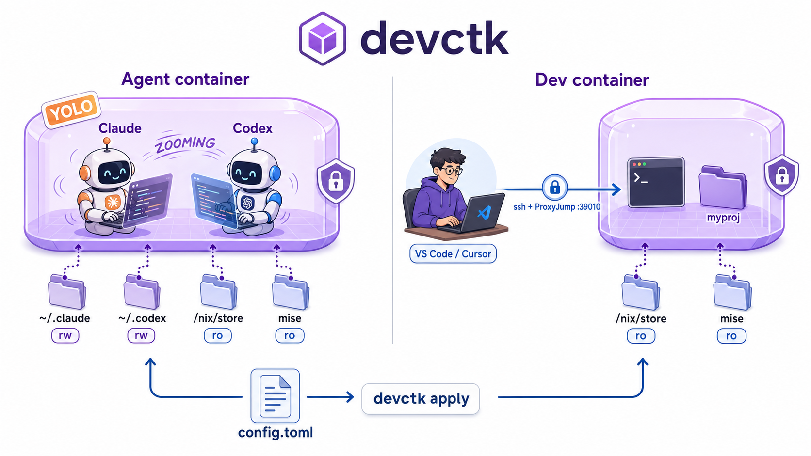
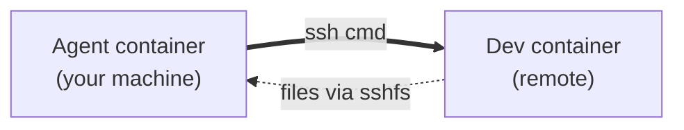

# devctk



> **Frustrated by any of these?**
>
> - Running `claude --dangerously-skip-permissions` or `codex --full-auto` as your laptop user, hoping it doesn't touch the wrong file
> - Wanting a clean per-project shell that still has your host nix, mise, and the project at its real path — without baking a Dockerfile, without sudo
> - Wanting an agent to help on a remote dev box, but having no clean way to keep its runtime separate from yours

devctk fixes all three with **rootless Podman** and one TOML file. No sudo anywhere. No Dockerfiles to maintain. No daemon.

```sh
uv tool install devctk
```

## Two patterns it nails

### ① distrobox-style dev shell — your tools, contained, SSH-ready

You want a clean per-project shell. You also want your host nix and mise on `PATH`, and your project visible at its real path so editor and terminal agree. You don't want to bake a Dockerfile, and you don't have sudo.

Same shape as distrobox, declarative, with optional SSH for VS Code Remote / Cursor / `ssh + nvim`:

```toml
[[containers]]
name = "myproj"
image = "docker.io/library/ubuntu:24.04"
systemd = true
nix = true
mise = true

[containers.workspace]
path = "/home/y/Projects/myproj"
mirror = true

[containers.ssh]
port = 39010
authorized_keys_file = "/home/y/.ssh/container_authorized_keys"
```

On the laptop:

```ssh-config
Host myproj
  HostName 127.0.0.1
  Port 39010
  ProxyJump workstation   # omit if running locally
```

### ② Agent in a YOLO sandbox — same isolation, no shared host

You want `claude --dangerously-skip-permissions` or `codex --full-auto` to do its thing without you babysitting every approval. You don't want it running as your laptop user with reach into your shell history, ssh keys, and unrelated projects. devctk puts it in a container with `~/.claude` and `~/.codex` bind-mounted rw (so logins persist across recreates) and host `/nix/store` + mise mounted in (so the agent has the same toolchain you do).

```toml
[[containers]]
name = "myproj-agent"
image = "docker.io/library/ubuntu:24.04"
agents = ["claude", "codex"]
nix = true
mise = true

[containers.workspace]
path = "/home/y/Projects/myproj"
mirror = true
```

`devctk apply` → `podman exec -it myproj-agent bash` → `claude --dangerously-skip-permissions` and walk away.

### Bonus combo — local agent, remote dev container

The cool one. Run the agent container on your machine and the dev container on a remote (lab box, GPU server, anywhere). The agent reaches the dev box over two channels: `ssh` for commands, `sshfs` for files.



This is exactly the decoupling [Anthropic's managed-agents writeup](https://www.anthropic.com/engineering/managed-agents) argues for: the agent's runtime stays separate from the environment it acts on, joined only by `ssh` and `sshfs`.

## Rootless, no sudo

Everything devctk does runs as your unprivileged user:

- Podman runs rootless
- The autostart unit is a user-level systemd oneshot
- `sudo loginctl enable-linger "$USER"` is the **only** place `sudo` shows up, and only if you want autostart to survive a full reboot before you log in

## How it works, in one paragraph

`devctk` reads `~/.config/devctk/config.toml`, diffs it against a normalized state file, and applies the minimum plan: **create** a new container, **recreate** when a runtime field changed, **start** when stopped, **update** when only metadata changed, **destroy** when you removed it from config. No daemon. Whitespace and TOML formatting never force a recreate — the diff runs on semantic form. Containers marked `systemd = true` come back via a user-level oneshot at login/boot.

## More

- [QUICKSTART.md](QUICKSTART.md) — install, systemd autostart, full config reference, `apply` / `ls` / `rm` lifecycle
- Requires Linux, rootless Podman, Python 3.11+, and a Debian/Ubuntu base image
- MIT licensed
