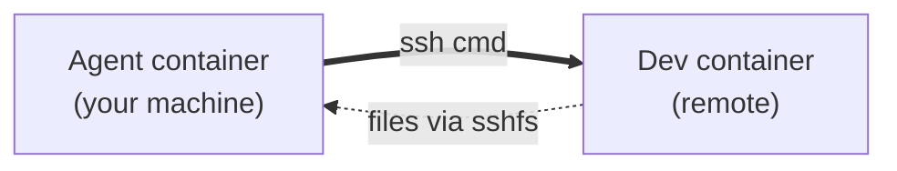

# devctk


> **Frustrated by any of these?**
>
> - Running `claude --dangerously-skip-permissions` or `codex --full-auto` with your workspace, agent config, and session history in reach, hoping it doesn't touch the wrong file
> - Wanting a clean env with your host's nix and mise on `PATH`, without writing a Dockerfile to bake them in
> - Wanting an agent to do work on a remote dev box without giving it your shell history, ssh keys, or dotfiles

devctk fixes all three with **rootless Podman** and one TOML file. No sudo anywhere. No Dockerfiles to maintain. No daemon.

```sh
uv tool install devctk
```

## Two patterns it nails

### ① Dev env — host nix/mise inside, SSH-accessible

You want a clean env that still has your host nix and mise on `PATH`, and your project visible at its real path. You don't want to bake a Dockerfile, and you don't have sudo. (Think distrobox, but declarative.)

Optional SSH wires it up to VS Code Remote / Cursor / `ssh + nvim`:

```toml
[[containers]]
name = "myproj"
image = "docker.io/library/ubuntu:24.04"
systemd = true
nix = true
mise = true

[containers.workspace]
path = "/home/you/Projects/myproj"
mirror = true

[containers.ssh]
port = 39010
authorized_keys_file = "/home/you/.ssh/container_authorized_keys"
```

On the laptop:

```ssh-config
Host myproj
  HostName 127.0.0.1
  Port 39010
  ProxyJump workstation   # omit if running locally
```

### ② Agent in a YOLO sandbox — same isolation, no shared host

You want `claude --dangerously-skip-permissions` or `codex --full-auto` to do its thing without you babysitting every approval — but not with free run of your shell history, ssh keys, and unrelated projects.

devctk puts the agent in a container, with two key bind-mounts:

- `~/.claude` and `~/.codex` rw — logins, history, and credentials persist across container recreates
- host `/nix/store` and mise installs — the agent uses the same toolchain you do

```toml
[[containers]]
name = "myproj-agent"
image = "docker.io/library/ubuntu:24.04"
agents = ["claude", "codex"]
nix = true
mise = true

[containers.workspace]
path = "/home/you/Projects/myproj"
mirror = true
```

`devctk apply` → `podman exec -it myproj-agent bash` → run the agent unattended. Whatever it touches stays inside the container.

### Bonus combo — local agent, remote dev container

The cool one. Run the agent container on your machine and the dev container on a remote (lab box, GPU server, anywhere). They meet over two channels:

- **`ssh`** — the agent shells into the remote dev container to run commands (start a training run, run tests, tail logs) and stream output back
- **`sshfs`** — the remote workspace is mounted on your host with sshfs and bind-mounted into the agent container, so the agent reads and writes remote files as if they were local



The win: the agent has its own filesystem, its own user, its own dotfiles — none of which the dev box has to trust. The dev box has the GPU, the datasets, the heavy state — none of which the agent has to carry locally. It's the same decoupling [Anthropic's managed-agents writeup](https://www.anthropic.com/engineering/managed-agents) argues for, applied to the local-vs-remote axis.

## Rootless, no sudo

Everything devctk does runs as your unprivileged user:

- Podman runs rootless
- The autostart unit is a user-level systemd oneshot
- `sudo loginctl enable-linger "$USER"` is the **only** place `sudo` shows up, and only if you want autostart to survive a full reboot before you log in

## How it works, in one paragraph

`devctk` reads `~/.config/devctk/config.toml`, diffs it against a normalized state file, and applies the minimum plan: **create** a new container, **recreate** when a runtime field changed, **start** when stopped, **update** when only metadata changed, **destroy** when you removed it from config. No daemon. Whitespace and TOML formatting never force a recreate — the diff runs on semantic form. Containers marked `systemd = true` come back via a user-level oneshot at login/boot.

## More

- [QUICKSTART.md](QUICKSTART.md) — install, systemd autostart, full config reference, `apply` / `ls` / `rm` lifecycle
- Requires Linux, rootless Podman, Python 3.11+, and a Debian/Ubuntu base image
- MIT licensed
